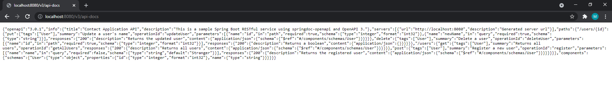
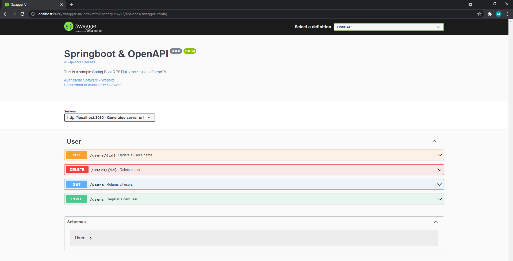

## Sample Spring Boot RESTful service using OpenAPI 3

### Step 1 - Adding OpenAPI to our project

First, we need to add the dependency to our pom.xml:
```
<dependency>
    <groupId>org.springdoc</groupId>
    <artifactId>springdoc-openapi-ui</artifactId>
    <version>1.5.10</version>
</dependency>
```

Then we need to add the configuration class to our project:
```
@Configuration
public class SwaggerConfig {

    /*
    User API
     */
    @Bean
    public GroupedOpenApi userApi() {
        final String[] packagesToScan = {"com.controller"};
        return GroupedOpenApi
                .builder()
                .group("User API")
                .packagesToScan(packagesToScan)
                .pathsToMatch("/users/**")
                .addOpenApiCustomiser(statusApiCostumizer())
                .build();
    }

    private OpenApiCustomiser statusApiCostumizer() {
        return openAPI -> openAPI
                .info(new Info()
                        .title("Springboot & OpenAPI")
                        .description("This is a sample Spring Boot RESTful service using OpenAPI")
                        .version("3.0.0")
                        .contact(new Contact()
                                .name("Avangarde Software")
                                .url("https://avangarde-software.com/")
                                .email("markos.kosa@avangarde-software.com")));
    }

    @Bean
    public OpenAPI customOpenAPI() {
        return new OpenAPI()
                .components(new Components())
                .info(new Info().title("Contact Application API").description(
                        "This is a sample Spring Boot RESTful service using springdoc-openapi and OpenAPI 3."));
    }

}
```

### Step 2 - Looking at Swagger

When we start our application, we will have two new endpoints.

The first represents the OpenAPI specification of our application.

[http://localhost:8080/v3/api-docs](http://localhost:8080/v3/api-docs)



The second endpoint represents the Swagger UI, which we can now use to invoke and explore our API.

[Swagger UI](http://localhost:8080/swagger-ui.html)



For an easier access, we can change the Swagger UI URL to anything that we want.

For that, we need to access `application.properties` and add the following property:

`springdoc.swagger-ui.path=/apidoc`

This will set our Swagger UI URL to: [http://localhost:8080/apidoc](http://localhost:8080/apidoc)

### Step 3 - Add annotations to endpoints

In order for our endpoints to be visible in Swagger, we need to mark each of them with `@Operation` tag.

Here is an example:

```
    @PostMapping("/users")
    @Operation(summary = "Register a new user", tags = {"User",},
            responses = {
                    @ApiResponse(responseCode = "200",
                            description = "Returns the registered user",
                            content = @Content(mediaType = "application/json",
                                    schema = @Schema(implementation = User.class)))
            })
    @ResponseBody
    public User register(@RequestParam(name = "name", required = false, defaultValue = "Stranger") String name) {
        User newUser = new User(counter.incrementAndGet(), name);
        return userRepository.addUser(newUser);
    }
```

### Step 4 - Generate a client

The advantage of having the OpenAPI specification available is that
generating a client code to call our API is now quite easy.

For this, we can use various tools such as: [OpenAPI Generator](https://openapi-generator.tech/)
